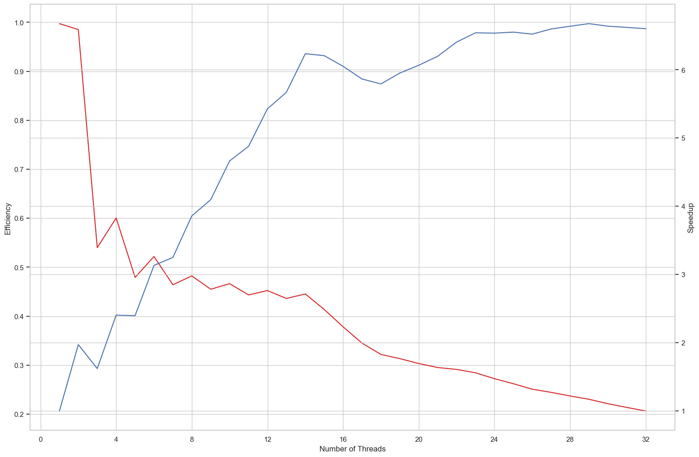

# Solution and Answers

The specific hardware and software used for this exercise can be found at [MACHINE.md](../MACHINE.md).

## Implementation

The parallel solution just splits the image rows equally amongst the requested number of threads.

## Timings

With the help of a python script ([timing.py](bench/timing.py)), the timing and speedup were taken from 100 executions of each `numThreads` from 1 to 32. The results[^detail] can be found at [results.csv](bench/results.csv) and are summarized in the following graph, along with the efficiency measured.

[^detail]: The data was collected with the computer in a somewhat idle state, outside a graphical environment and with a minimal amount of services running in the background.

## Answers

### 1. What is the optimal number of threads to use?

From the graph above, 14 threads seems to be the best for my machine. After that the speedup doesn't increase much.

### 2. What is the maximum number of threads you can create?

The code is setup to max out at 32 threads. If that wasn't the case, the maximum would be either `/proc/sys/kernel/threads-max` (126451 in my machine) or hwo many threads my RAM and swap can hold.

### 3. What happens if you create more threads than cores in the CPU?

Threads are a software abstraction to run concurrent code, while cores are actual hardware that run in parallel. As such, when there are more threads than cores, they can't all run at the same time, but instead they need to share the cores between them. Still, using more threads than cores may be beneficial, since the come may use some of its running time waiting on a OS call and, in this wait time, another thread could use the core.

For this exercise I expected the speedup to stop increasing after 8 threads, but that did not happen up until 29 threads.
